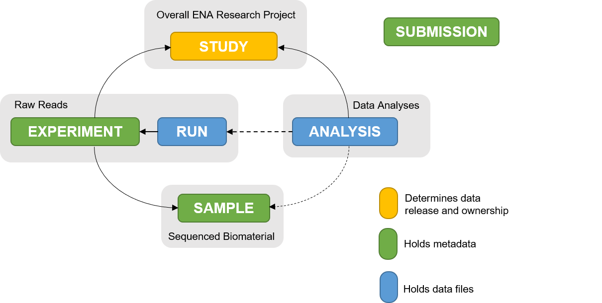

# q2-ena-uploader
The <b>q2-ena-uploader</b> is a  <a href="https://qiime2.org/">QIIME 2</a> plugin designed for the programmatic submission of metadata and raw sequence reads to the European Nucleotide Archive (ENA).
<p align="center">

</p>
To develop this plugin, we followed the <a href="https://ena-docs.readthedocs.io/en/latest/index.html">ENA documentation</a>. The submission process is depicted in the image above.


## Installation

## Usage

### Available actions
The ena-uploader offers several actions for adding, deleting, and modifying your submission. See the list below for details:
| Action               | Description                                                       |
|----------------------|-------------------------------------------------------------------|
| `upload-to-ena`        | Metadata upload to the ENA repository.                            |
| `cancel-ena-submission`| Cancel ENA metadata submission.                                   |
| `transfer-files-to-ena`|Raw files upload to the ENA ftp.                                   |
| `upload-reads-to-ena`| Upload experiment and runs to ENA.                                   |

For a more detailed description of each action, refer to the sections below.

### Import metadata

#### 1) Study
To import the metadata of an existing study into the corresponding QIIME artifacts, run:

```shell
qiime tools import \
              --type ENAMetadataStudy \
              --input-path study.tsv \
              --output-path study.qza
```
where:
- `--input-path` is a path to the TSV file containing metadata of a study or samples,
- `--output-path` is the output artifact.

__Note__: When constructing a valid metadata TSV file, consider using one of the provided <a href="ena_uploader/templates/">templates</a>.
To create a valid study TSV file, two mandatory parameters are required: alias and title. All other parameters are optional. For fields such as URL links, both the description and the link should be combined into a single field in the TSV file, separated by a | symbol, as illustrated in the examples.


#### 2) Samples

```shell
qiime tools import \
              --type ENAMetadataSamples \
              --input-path samples.tsv \
              --output-path samples.qza
```


__Note:__  For sample submission, ENA provides metadata checklists detailing the minimal attributes required for different sample types. Please review the full range of checklists <a href="https://www.ebi.ac.uk/ena/browser/checklists">here</a> before submitting your samples. 

__Note:__ When using the default checklist for all your samples, you don’t need to specify the default code <a href="https://www.ebi.ac.uk/ena/browser/view/ERC000011"> ERC000011 </a>. However, if you apply multiple checklists for different samples, you must include all relevant codes in the metadata column checklist. For more examples see <a href="ena_uploader/templates/">templates</a>.

__Note__: Minimal study structure refers to the default data checklist. To create a valid TSV file, four mandatory parameters are needed for each sample: `alias` (qiime sample id), `taxon_id`, `geographic location (country and/or sea)` and `collection date`, see <a href="ena_uploader/templates/">templates</a>.


#### 3) Experiment
```shell
qiime tools import \
              --type ENAMetadataExperiment \
              --input-path experiment.tsv \
              --output-path experiment.qza
```
__Note:__  For experiment submission, ENA supports controlled vocabulary in the metadata fields, which can be accessed <a href =https://ena-docs.readthedocs.io/en/latest/submit/reads/webin-cli.html>here</a>. 

__Note__: The minimal experiment structure requires the following mandatory fields:  `title`, `study_ref` (study alias or accession number), `sample_description` (qiime sample id), `platform`, `instrument_model`, `library_strategy`,`library_source`, `library_selection`, `library_layout`,	`library_nominal_length` (only for paired reads),	`library_nominal_sdev` (only for paired reads). The field `library_construnction_protocol` is optional. For more details, see  the <a href="ena_uploader/templates/">templates</a>.

### Upload metadata

1) Before uploading to ENA, you need to set two environmental variables. To set these environment variables run the following commands in your terminal  `export ENA_USERNAME=<Webin-XXXXXX> ` and `export ENA_PASSWORD=<password>.` 

__Note__: Please ensure that your credentials are set at least 24 hours before your first submission to the ENA server.

2) Use qiime action to upload Study and Samples to ENA:

```shell
qiime ena-uploader upload-to-ena \
              --i-study study_metadata.qza \
              --i-samples samples_metadata.qza \
              --p-action_type\
              --p-dev server_type \
              --p-submission_hold_date \
              --o-submission-receipt  receipt.qza 
```
where:
- ` --i-study` is an artifact containing metadata of a study,
- ` --i-samples` is an artifact containing metadata of the samples,
- `--p-action-type` 2 action types are supported : ADD as a default and MODIFY,
- `--p-dev`  a boolean parameter (default: True), indicating whether the submission is a test.
- `--p-submission-hold-date`  the release date of the study, on which it will become public along with all submitted data.
                                By default, this date is set to two months after the date of submission. Users can specify any date within two years of the current date. Accepted date format is `year-month-day`.
- `--output-path` This is an output artifact containing the assigned ENA accession numbers for the submitted objects.

__Note__: You can submit a study and metadata either separately or together; only one of the corresponding artifacts is required for submission. However, please note that to submit raw reads later, both the study and samples must already exist on the ENA server.

### Upload Raw Reads

1) Before submitting the experiment, you must first transfer your files to the ENA FTP server. Ensure again that your environment variables ENA_USERNAME and ENA_PASSWORD are properly set.

2) Use the qiime action to transfer the fastq file to ENA FTP.

```shell
qiime ena-uploader trasfer-files-to-ena \
                --i-demux CasavaOneEightSingleLanePerSampleDirFmt\
                --p-action  ADD\
                --o-metadata metadata.qza 
```

demux: CasavaOneEightSingleLanePerSampleDirFmt,
                          action: str = 'ADD'

where:
- `--i-demux`  The demultiplexed sequencing data, either single-end or paired-end reads.
- `--p-action` Specifies the action to take. The default is ADD, but you can use DELETE to remove files from the ENA FTP server.
- `--metadata` This is an output artifact containing information about the transfer or deletion status of files on the ENA FTP server.

3) Use qiime action to upload Experiment to ENA:

```shell
qiime ena-uploader upload-reads-to-ena \
              --i-demux CasavaOneEightSingleLanePerSampleDirFmt \
              --i-experiment experiment_metadata.qza \
              --p-submission-hold-date\
              --p-action-type server_type \
              --p-dev\
              --o-submission-receipt  receipt.qza 
```
where:
- ` --i-demux` The demultiplexed sequencing data, either single-end or paired-end reads.
- ` --i-experiment` Artifact containing experiments submission parameters.
- `--p-action_type` 2 action types are supported : ADD as a default and MODIFY.
- `--p-dev`  a boolean parameter (default: True) indicating whether the submission is a test.
- `--p-submission_hold_date`  The release date for the data submission, determining when it will become public. The accepted date format is      YYYY-MM-DD.
- `--output-path` This is an output artifact containing the assigned ENA accession numbers for the submitted objects.

## License
q2-ena-uploader is released under a BSD-3-Clause license. See LICENSE for more details.


